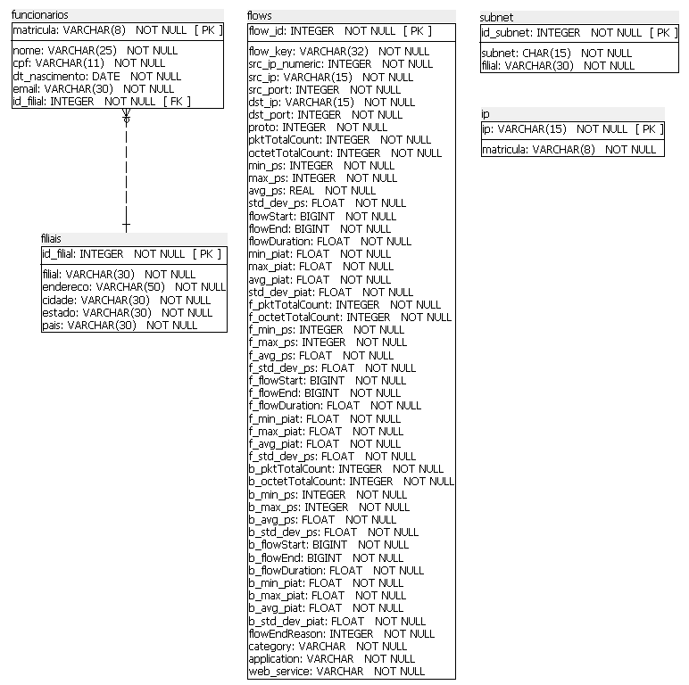
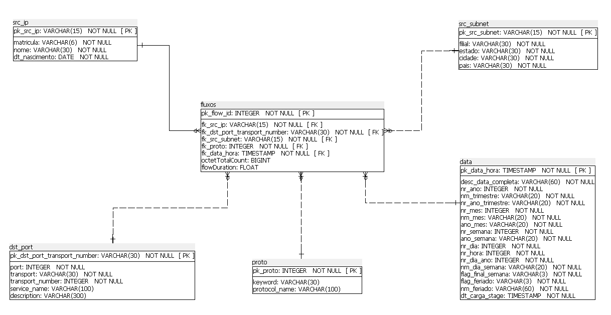
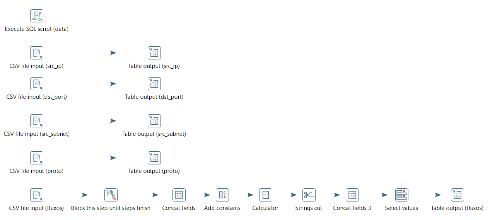
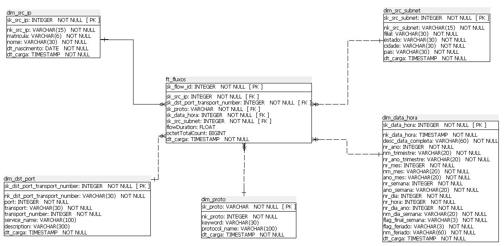
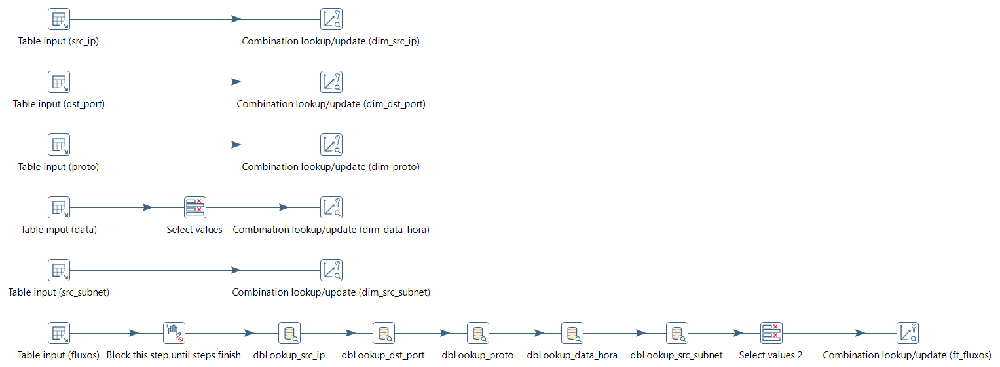
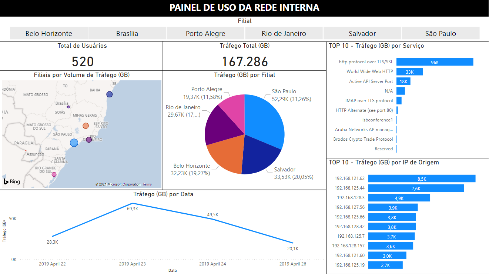

# Business Intelligence aplicado a Fluxos de Rede

#### Aluno: [Carlos Renato Lemos Rodrigues](https://github.com/carlosrenatolr).
#### Orientador: [Anderson Nascimento](https://github.com/insightds).

---

Trabalho apresentado ao curso [BI MASTER](https://ica.puc-rio.ai/bi-master) como pré-requisito para conclusão de curso e obtenção de crédito na disciplina "Projetos de Sistemas Inteligentes de Apoio à Decisão".

- [Link para o código](https://github.com/carlosrenatolr/Business-Intelligence-aplicado-a-Fluxos-de-Rede).

- [Link para a monografia](Business%20Intelligence%20aplicado%20a%20Fluxos%20de%20Rede.docx).

---

### Resumo

O uso do protocolo IPFIX, também conhecido como Netflow, é largamente utilizado pelas equipes de redes de telecomunicações das empresas para efeito de dimensionamento, capacidade e resolução de problemas. Este artigo descreve que esses dados também podem ser usados pelo corpo gerencial de uma empresa para tomada de decisões, através de um dashboard interativo criado no Microsoft Power BI.

### Abstract

The use of the IPFIX protocol, also known as Netflow, is widely used by companies telecommunications network teams for the purpose of sizing, capacity and troubleshooting. This paper describes that this data can also be used by the management body of a company for decision-making processes, through an interactive dashboard created in Microsoft Power BI.

### 1. Introdução

Empresas de médio e grande porte possuem o desafio de gerenciar sua rede interna de telecomunicações a fim de garantir a continuidade operacional de seus negócios e manter a satisfação de seus clientes a níveis satisfatórios, ao mesmo tempo que mantém os custos de operação e manutenção em patamares aceitáveis. Para isso, é preciso coletar dados de tráfego de toda a rede e manipulá-los para extrair informações relevantes e aplicá-las à tomada de decisão pelos órgãos competentes da empresa.
Uma forma de coletar e armazenar tais dados de tráfego é usando o recurso desenvolvido pela Cisco chamado Netflow, que foi substituído pelo protocolo IPFIX (Internet Protocol Flow Information eXport). No presente artigo, os dados apresentados por esse protocolo serão chamados, de forma genérica, de Fluxos de Rede, ou, resumidamente, de fluxo. O protocolo mostra informações de tráfego de rede relevantes como o IP de origem e destino do fluxo, portas de origem e destino, protocolo da camada de Transporte do Modelo OSI (TCP ou UDP, na maioria dos casos), data e hora de início do fluxo, duração e total de bytes trafegados durante a comunicação.
Este artigo tem por objetivo apresentar as vantagens do uso de técnicas de Business Intelligence (BI) aplicado a dados de fluxos rede, desde a extração dos dados brutos, transformação dos dados e apresentação destes por meio de dashboards, para que as empresas possam melhor gerir seus recursos de rede, apontar possíveis anomalias e auxiliar a tomada de decisão.

### 2. Estudo de Caso

Neste artigo, serão analisados dados de uma empresa fictícia que possui filiais nas cidades do Rio de Janeiro, Belo Horizonte, Brasília, Salvador, Porto Alegre e São Paulo. Embora a empresa em si não exista, serão usados dados reais retirados da plataforma [Kagle](https://www.kaggle.com/jsrojas/labeled-network-traffic-flows-114-applications). São dados coletados da rede interna da instituição de ensino Universidad Del Cauca, da Colômbia, em diferentes dias do mês de abril/2019.
A partir do modelo transacional atualmente em uso pela empresa, será proposto um modelo de Stage Area e Data Warehouse, fazendo as transformações necessárias nos dados, e culminando em um dashboard gerencial, em que informações básicas da rede interna sejam facilmente apresentadas, como o total de usuários, tráfego cursado, serviços de rede com mais tráfego e os maiores utilizadores da rede interna por IP de origem. E tudo isso podendo ser estratificado por filial.

### 3. Modelo Transacional

O Modelo Transacional é descrito de forma simplificada na Figura 1. A tabela “flows” foi retirada diretamente do banco de dados responsável por coletar todos os dados de fluxos de rede da empresa e contém todas as informações de fluxo de acordo com o descrito no protocolo IPFIX. A tabela “subnet” representa um cadastro de sub-redes mantido pela equipe que gerencia a rede interna, atrelando cada sub-rede a uma filial. A tabela “ip” também é gerenciada por essa equipe, associando o IP do computador ao respectivo funcionário através da matrícula. Já as tabelas “funcionarios” e “filiais” foram retiradas do sistema de RH da empresa. Essas tabelas contêm dados básicos dos funcionários como nome, matrícula, CPF, data de nascimento e e-mail, e dados sobre as filiais, como o endereço, cidade e estado.

*Figura 1. Modelo Transacional da empresa.*

### 4. Stage Area

Usando o software Power Architect, foi criado um modelo Stage Area a partir dos dados extraídos do Modelo Transacional como um passo intermediário para chegar no Data Warehouse, confome detalhado na Figura 2. Os dados foram manipulados para criar um modelo do tipo “estrela”. Ao mesmo tempo, colunas consideradas não relevantes para o propósito final foram retiradas para tornar o modelo mais simples. Todo esse processo de ETL e carregamento de dados foi realizado com o software Pentaho, como mostra a Figura 3. A base de dados escolhida para carregar os dados do Stage Area foi o PostgreSQL, gerenciada usando a plataforma pgAdmin.

*Figura 2. Modelo Stage Area criado a partir dos dados do Modelo Transacional.*

*Figura 3. Projeto criado no Pentaho para carga do Stage Area*

### 5. Data Warehouse

Baseado no projeto do Stage Area, um Data Warehouse (DW) foi criado no PostgreSQL usando o Power Architect, de acordo com a Figura 4. O projeto do Pentaho da Figura 5 foi usado para a carga dos dados no DW.
Com o DW criado e devidamente populado com os dados, é possível utilizar ferramentas de Business Intelligence e Analytics como Power BI, Qlikview, Tableau e Spotfire para criação de dashboards gerenciais que ajudarão a empresa nos processos de tomada de decisão.

*Figura 4. Modelo DW criado a partir do Stage Area.*

*Figura 5. Projeto criado no Pentaho para carga do Data Warehouse.*

### 6. Construção do dashboard gerencial

Para analisar os dados e criar dashboards gerenciais, foi usada a ferramenta de Business Intelligence da Microsoft, o Power BI.
No dashboard intitulado “Painel de Uso da Rede Interna”, como mostra a Figura 6, o corpo gerencial da empresa tem acesso rápido a alguns dados importantes como o total de usuários únicos da rede, o total de tráfego cursado durante o período de tempo analisado, além de consultar o tráfego em GB pelo dia do ano. O dashboard também possui outras visualizações como um mapa contendo a localização geográfica das filiais, cujo tamanho do ponto corresponde ao volume de dados trafegados daquela filial, uma pizza estratificando o tráfego por filial (para ter uma visão percentual da contribuição de cada unidade da empresa) e dois gráficos de barras mostrando o TOP 10  - Tráfego (GB) por serviço (tipo de protocolo de comunicação utilizado pelo usuário) e o TOP 10 – Tráfego (GB) por IP de Origem, em que é possível identificar os funcionários que mais utilizam a rede, em termos de volume de dados, através de seu IP. É importante ressaltar que o relatório criado no Power BI é interativo, ou seja, o usuário pode filtrar todas as visualizações a seu critério, por exemplo, mostrando todos os dados de apenas uma filial.

*Figura 6 – Dashboard Gerencial criado no Microsoft Power BI.*

### 7. Conclusão

Neste artigo foi evidenciado que os dados gerados pelo uso do protocolo IPFIX, ou Netflow, além de ser primordial para as equipes de rede e telecomunicações de uma empresa, também pode ser bastante útil para o corpo gerencial tomar decisões de forma rápida através de um dashboard criado em uma ferramenta de Business Intelligence.

---

Matrícula: 192.671.028

Pontifícia Universidade Católica do Rio de Janeiro

Curso de Pós Graduação *Business Intelligence Master*
